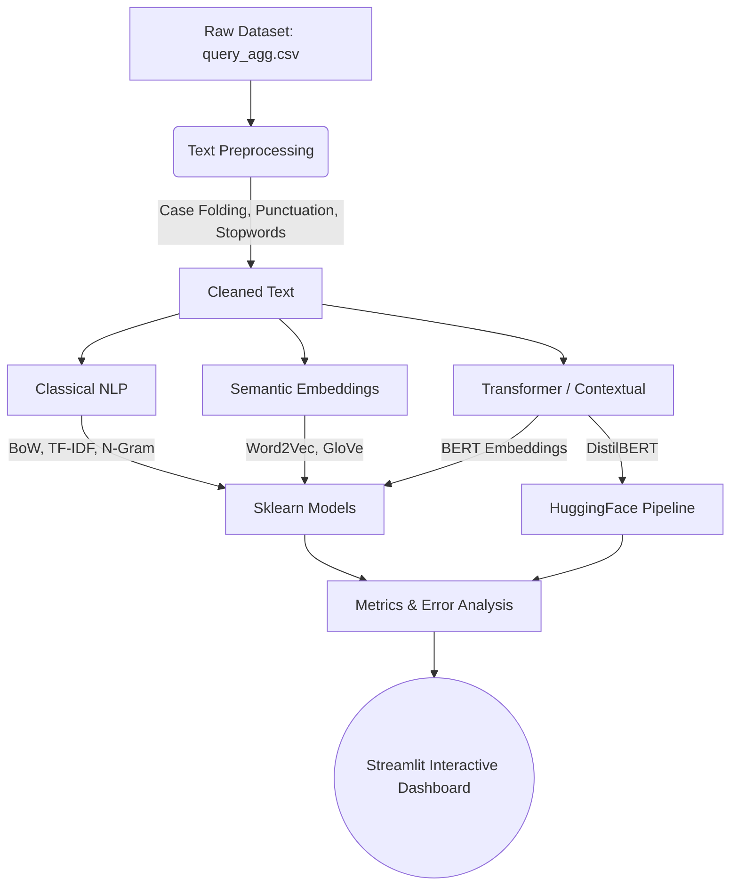

<h1 align="center">🌱 Kisan Query NLP Dashboard: Feature Representation Analysis</h1>

<div align="center">
  
  
  
  
  
  
</div>

<br>

<p align="center">
  <b>A production-ready NLP dashboard evaluating and comparing 13 different text representation models (Classical vs. Semantic vs. Contextual Embeddings) for classifying agricultural text data.</b>
</p>

---

## 📖 Overview

The **Kisan Query NLP Dashboard** is an end-to-end Machine Learning research project built to evaluate how different Natural Language Processing (NLP) feature extraction techniques impact classification performance on agricultural queries. 

The project classifies real-world queries into two main sectors: **Agriculture** and **Horticulture**, dealing with challenges such as class imbalance, short queries, and contextual ambiguity. It leverages a modern Streamlit interface to visualize the end-to-end NLP pipeline—from data preprocessing to deep error analysis and real-time inference.

*(Insert a screenshot or GIF of your dashboard overview here)*

---

## 🎯 Key Features

1. **Comprehensive Model Comparison (13 Models)**
   * **Classical NLP:** BoW, TF-IDF, N-Gram paired with Decision Tree (DT) and Naive Bayes (NB).
   * **Semantic Embeddings:** Word2Vec, GloVe paired with DT and NB.
   * **Contextual Embeddings:** BERT features paired with DT and NB.
   * **Transformers:** End-to-End Fine-Tuned DistilBERT.

2. **Deep Error Analysis System**
   * Goes beyond standard metrics (Accuracy, F1-Score).
   * Dynamically tracks **False Positives** and **False Negatives**.
   * Identifies root causes of misclassifications such as *Short Queries*, *Contextual Ambiguity*, and *Feature/Semantic Limitations*.
   * Built-in *Explainability* (Feature Importance) to expose the top keywords driving classical model decisions.

3. **Interactive & Optimized UI/UX**
   * **Zero-Training Startup**: Loads 13 pre-trained `.pkl` and `.safetensors` models directly into memory for lightning-fast startup (< 30s load time).
   * Interactive **Real-Time Prediction** engine to test out queries on any model.
   * Step-by-step interactive **Text Preprocessing** visualization.

---

## 🧠 System Architecture



---

## 🛠️ Tech Stack Demonstrated

* **Data Engineering & Preprocessing**: `Pandas`, `NLTK` (Stopword removal, tokenization).
* **Machine Learning**: `Scikit-Learn` (Decision Tree, Naive Bayes, Vectorizers, Evaluation Metrics).
* **Deep Learning & Transformers**: `PyTorch`, `Hugging Face Transformers` (DistilBERT Fine-tuning).
* **Word Embeddings**: `Gensim` (Word2Vec).
* **Data Visualization**: `Plotly` (Interactive Confusion Matrices, Radar Charts, Bar Charts).
* **Software Engineering**: Modular architecture (Separation of UI `pages/`, `backend/`, and `components/`), caching mechanisms, and state management.

---

## 🚀 Getting Started

### Prerequisites
* Python 3.9 - 3.11
* Minimum 8GB RAM (due to the concurrent loading of BERT, GloVe, Word2Vec, and 12 Sklearn models).

### Installation

1. **Clone the repository**
   ```bash
   git clone https://github.com/rifqidzaki/NEW_Dasboard_NLP.git
   cd NEW_Dasboard_NLP
   ```

2. **Set up a virtual environment**
   ```bash
   python -m venv .venv
   # Windows
   .\.venv\Scripts\activate
   # macOS/Linux
   source .venv/bin/activate
   ```

3. **Install dependencies**
   ```bash
   pip install -r requirements.txt
   ```

4. **Run the Application**
   ```bash
   streamlit run app.py
   ```

> **Note on Data and Large Models:** 
> Due to GitHub's file size limits, the original dataset (`query_agg.csv` - ~1GB), `glove.6B.50d.txt` (400MB), and the `DistilBERT` `.safetensors` weights (268MB) are ignored via `.gitignore` and are not included in this repository.


## 📝 License

Distributed under the MIT License. See `LICENSE` for more information.

---
<div align="center">
<b>Built with passion for NLP Research and AI Engineering 🚀</b>
</div>
